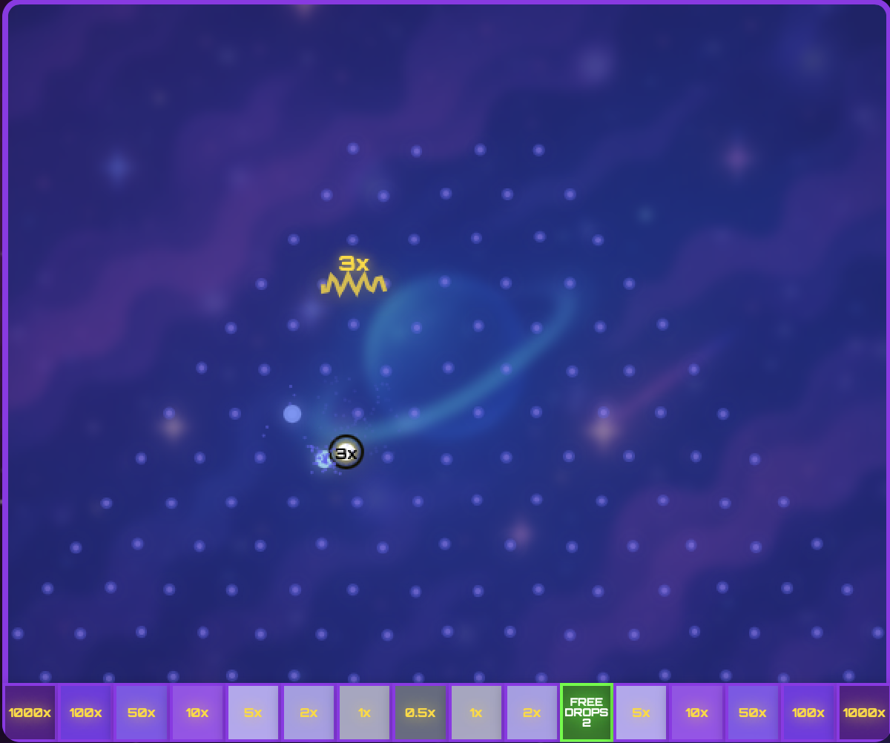

<div align="center">



# 🚀 Cosmic Plinko — #BovadaPlinkoChallenge

🏆 **1st Place Winner of the $5,000 Bovada Plinko Challenge**  
A polished, high-performance Plinko game featuring a cosmic aesthetic, physics-based gameplay, immersive audio, and PWA support — designed to be played anywhere, anytime.

[](https://nextjs.org/)
[](https://www.typescriptlang.org/)
[](https://tailwindcss.com/)
[](https://web.dev/progressive-web-apps/)

🎮 [Play the Live Game](https://bovadacosmicplinkochallange.netlify.app/)  
📱 [Install as a PWA](#-pwa-installation) • ⚙️ [Setup & Development](#-installation) • 🔬 [Tech Overview](#-tech-overview)

</div>

---

## 🧾 Summary

Cosmic Plinko is a space-themed, browser-based Plinko game that won **1st place 🏆** in the **$5,000 #BovadaPlinkoChallenge**.  
The game combines fast-paced, physics-based ball simulation with electric multipliers, free drops, and immersive audio for a fully polished arcade experience.

---

## 🌟 Features

- 🎯 **Realistic Ball Physics** — Simulated gravity, bounce, velocity, and randomness
- ⚡ **Electric Multiplier Lines** — Boost prizes by 2x–5x with stackable multiplier zones
- 🎁 **Free Drops Mode** — Trigger bonus balls and win extra payouts
- 🚀 **Turbo Mode** — 2x speed gameplay for faster action
- 🎵 **Immersive Audio** — Web Audio API-powered background music and effects
- 📈 **Live Balance Tracker** — Real-time tracking of total wins, losses, and bets
- 📱 **Progressive Web App (PWA)** — Works offline, installable on mobile and desktop
- 🎨 **Cosmic Theme** — Floating aliens, glowing UI, particle FX, and clean visuals

---

## 📦 Installation

### Requirements

- Node.js v18+
- npm or yarn

### Getting Started

```bash
git clone https://github.com/yourusername/cosmic-plinko.git
cd cosmic-plinko
npm install
npm run dev
```

Visit [http://localhost:3000](http://localhost:3000) to play locally.

### Production

```bash
npm run build
npm start
```

Or deploy instantly using [Vercel](https://vercel.com) or [Netlify](https://netlify.com).

---

## 📱 PWA Installation

### Desktop
- Chrome/Edge: Click install icon in the address bar  
- Safari: File → Add to Dock

### Mobile

**iOS (Safari)**  
- Tap Share → Add to Home Screen

**Android (Chrome)**  
- Tap Menu (⋮) → Add to Home Screen

---

## 🎮 How to Play

1. **Choose Your Bet**: Select from $0.50 to $10.00 per ball
2. **Select Ball Count**: Drop 1 to 10 balls simultaneously
3. **Hit DROP or Press SPACEBAR** to release the balls
4. Balls bounce through pegs and land on multiplier slots
5. **Win Based on Multiplier × Bet**

### Bonus Modes
- **Electric Multiplier Lines**: Boost payout by up to 5x per line hit  
- **Free Drops**: Trigger auto-play bonus rounds with enhanced multipliers  
- **Turbo Mode**: Double speed for quick plays with same win odds

---

## 🔬 Tech Overview

- #Next.js — App Router, server/client optimization
- #TypeScript — Type-safe logic and scalable architecture
- #TailwindCSS — Modern utility-first design
- #CanvasAPI — High-performance graphics for rendering gameplay
- #WebAudioAPI — Reactive audio effects and background music
- #PWA — Offline support, service workers, installable experience
- #HTML5 + #CSS3 — Seamless web compatibility
- #GitHub — Version control & open-source collaboration

---

## 🌐 Compatibility

| Platform | Support | Status |
|----------|---------|--------|
| Desktop  | PWA + Audio | ✅ |
| iOS      | PWA (Add to Home Screen) | ✅ |
| Android  | Full PWA | ✅ |
| Chrome   | Full | ✅ |
| Safari   | Limited PWA | ✅ |
| Firefox  | Full | ✅ |

---

## 📄 License

**MIT License** — Use freely, modify, and distribute with attribution.

---

## 🙌 Acknowledgments

- 🏆 **#BovadaPlinkoChallenge** for the opportunity and prize  
- 🚀 **Next.js & Vercel** for blazing-fast deployment  
- 🎧 **Web APIs** — Canvas, Audio, PWA standards  
- 💜 Built with love for the browser gaming community

---

<div align="center">
🎮 [Play the Game](https://bovadacosmicplinkochallange.netlify.app/) • ⭐ Star the Repo • Built for $5K & the win 🏆  
</div>
